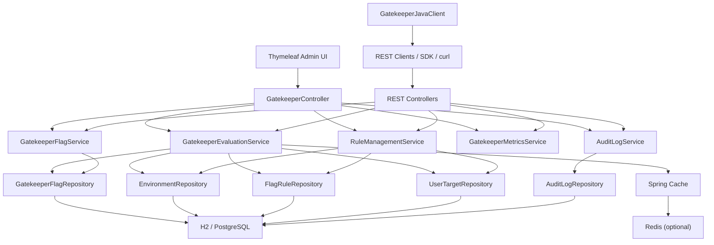

# GateKeeper

GateKeeper is a Spring Boot feature flag management platform with REST APIs, simple Thymeleaf admin pages, environment-aware rule evaluation, Redis-backed caching support, audit logs, metrics, and a lightweight Java SDK simulator.

## What This Project Supports

- GateKeeper flag CRUD
- optimistic locking on flags
- kill switch support for immediate shutdown of a flag
- soft delete via archiving instead of hard delete
- simple RBAC with admin and viewer roles
- Environment-specific flag rules
- Rule types:
  - `GLOBAL`
  - `USER_TARGET`
  - `PERCENTAGE`
- Deterministic evaluation using `flagKey + userId + environment`
- Redis-backed evaluation caching with cache invalidation
- Audit logging for configuration changes
- In-memory evaluation metrics
- Browser-based admin pages
- Java SDK simulation with local client-side caching
- H2 by default
- PostgreSQL profile support
- Unit tests and GitHub Actions CI

## Tech Stack

- Java 17
- Spring Boot 3.2.4
- Spring Web
- Spring Data JPA
- Thymeleaf
- Lombok
- Spring Cache
- Redis
- H2
- PostgreSQL
- JUnit 5
- Mockito

## Project Structure

```text
com.gatekeeper
├── GateKeeperApplication
├── config
│   ├── CacheConfig
│   └── DataInitializer
├── controller
│   ├── AuditLogController
│   ├── GatekeeperController
│   ├── GatekeeperEvaluationController
│   ├── GatekeeperManagementController
│   ├── GatekeeperMetricsController
│   └── RuleManagementController
├── dto
├── evaluation
│   └── FlagEvaluationEngine
├── model
│   ├── AuditLog
│   ├── Environment
│   ├── FlagRule
│   ├── GatekeeperFlag
│   ├── RuleType
│   └── UserTarget
├── repository
│   ├── AuditLogRepository
│   ├── EnvironmentRepository
│   ├── FlagRuleRepository
│   ├── GatekeeperFlagRepository
│   └── UserTargetRepository
├── sdk
│   ├── GatekeeperJavaClient
│   ├── GatekeeperSdkProperties
│   └── GatekeeperSdkSimulationRunner
└── service
    ├── AuditLogService
    ├── GatekeeperEvaluationService
    ├── GatekeeperFlagService
    ├── GatekeeperMetricsService
    └── RuleManagementService
```

## Domain Model

### `GatekeeperFlag`

- `id`
- `key`
- `name`
- `description`
- `enabled`
- `killSwitchEnabled`
- `archived`
- `version`
- `createdAt`
- `updatedAt`

### `Environment`

- `id`
- `name`

Seeded automatically on startup:

- `test`
- `uat`
- `prod`

### `FlagRule`

- `id`
- `flag`
- `environment`
- `ruleType`
- `percentage`
- `enabled`

### `UserTarget`

- `id`
- `flagRule`
- `userId`

### `AuditLog`

- `id`
- `entityType`
- `entityId`
- `action`
- `actor`
- `details`
- `createdAt`

## Evaluation Logic

`GatekeeperEvaluationService` evaluates a flag in this order:

1. If the flag does not exist or is globally disabled, return `false`
2. If the flag is archived or the kill switch is enabled, return `false`
3. If the environment does not exist, return `false`
4. If an enabled `GLOBAL` rule exists for that environment, return `true`
5. If an enabled `USER_TARGET` rule exists and the user is targeted, return `true`
6. If an enabled `PERCENTAGE` rule exists, hash `flagKey + userId + environment`
7. Convert the hash to a bucket from `0` to `99`
8. Return `true` if `bucket < percentage`
9. Otherwise return `false`

This means a flag can exist and still evaluate to `false` if no enabled matching rule exists for the selected environment.

### Deterministic Hashing

Percentage rollout uses deterministic hashing so the same user always lands in the same rollout bucket for the same flag and environment.

Why this matters:

- prevents feature flickering between requests
- makes rollouts predictable
- keeps user experience stable during staged rollouts

## Caching

GateKeeper caches evaluation results because `/api/evaluate` is the hot path in a real feature flag platform.

### What is cached

- `GatekeeperEvaluationService#evaluate(flagKey, userId, environment)`

Cache key format:

- `flagKey:userId:environment`

Example:

- `beta-checkout:alice:prod`

### Cache behavior

- default profile uses in-memory caching
- `redis` profile stores cached evaluation results in Redis
- cache entries are evicted on flag create, update, and delete
- cache entries are also evicted on rule changes, percentage changes, target changes, and rule status updates

Important distinction:

- H2 or PostgreSQL stores the source-of-truth configuration
- Redis stores computed evaluation results, not flag rows themselves

## Security

GateKeeper now includes simple RBAC with HTTP Basic authentication.

Roles:

- `admin` can read and modify flags, rules, SDK targets, and cached SDK state
- `viewer` can read flags, evaluate flags, inspect SDK state, metrics, and audit logs

Demo credentials:

- admin: `admin` / `admin123`
- viewer: `viewer` / `viewer123`

## Data Lifecycle

GateKeeper now uses soft delete for flags.

Instead of hard-deleting a flag:

- `archived=true` is set
- archived flags are excluded from normal reads and evaluation
- audit history remains intact

This preserves operational history while keeping active lists clean.

## Concurrency Control

GateKeeper flags now use optimistic locking via JPA `@Version`.

This helps prevent lost updates when two admins edit the same flag at the same time. If a stale update is submitted, the API returns a conflict instead of silently overwriting newer data.

## Architectural Trade-offs

- The client SDK uses polling plus a local TTL cache instead of push updates. This keeps the simulator simple and resilient, but means updates are eventually consistent rather than instant.
- Evaluation results are cached to protect the database hot path. Cache invalidation on flag and rule changes trades simplicity for coarse-grained eviction.
- Audit logs are persisted, but metrics are still in memory. This keeps the demo lightweight while leaving room for Prometheus-style export later.
- Soft delete was chosen over hard delete to preserve auditability and operational history at the cost of slightly more query logic.
- Basic auth with in-memory users is intentionally simple. It demonstrates RBAC and blast-radius control without introducing a full identity system.

## Hot Path

The hottest path in the system is flag evaluation:

`Client -> /api/evaluate -> Spring Cache -> Evaluation Service -> Repositories on cache miss -> Response`

On cache hits:

- evaluation returns without hitting the database

On cache misses:

- GateKeeper loads the flag, environment, rules, and targets as needed
- computes the deterministic result
- stores the result in cache for the next identical request

## Audit Logging

GateKeeper writes audit log entries for configuration changes.

### Logged events

- GateKeeper flag created
- GateKeeper flag updated
- GateKeeper flag deleted
- rule created
- user targets added
- percentage rollout changed
- rule enabled or disabled

Each entry stores:

- entity type
- entity id
- action
- actor
- details
- timestamp

The current implementation records the actor as `system`.

## Metrics

GateKeeper records in-memory evaluation metrics per flag.

### What is tracked

- total evaluations
- enabled evaluations
- disabled evaluations
- cache hits
- cache misses
- enabled ratio

### Metrics endpoints

- `GET /api/metrics/flags`
- `GET /api/metrics/flags?flagKey=beta-checkout`

Example response:

```json
{
  "flagKey": "beta-checkout",
  "totalEvaluations": 12,
  "enabledEvaluations": 7,
  "disabledEvaluations": 5,
  "cacheHits": 8,
  "cacheMisses": 4,
  "enabledRatio": 0.5833333333333334
}
```

## Java SDK Simulator

The project includes a lightweight Java SDK simulation to show how a client application can poll GateKeeper and cache locally.

### What it does

- polls one or more configured evaluation targets
- uses a local SDK cache first, with TTL-based expiry
- records whether the latest result came from `LOCAL_CACHE` or `REMOTE_FETCH`
- supports forced refresh of configured targets
- exposes SDK status and cache inspection through API and UI
- lets you add and remove SDK polling targets at runtime from the `/sdk` page
- fetches available flag keys dynamically from the main GateKeeper app so flags created in the UI can be added without restarting the simulator

### SDK properties

- `gatekeeper.sdk.base-url`
- `gatekeeper.sdk.local-cache-ttl-seconds`
- `gatekeeper.sdk.flag-key`
- `gatekeeper.sdk.user-id`
- `gatekeeper.sdk.environment`
- `gatekeeper.sdk.poll-interval-seconds`
- `gatekeeper.sdk.targets[n].flag-key`
- `gatekeeper.sdk.targets[n].user-id`
- `gatekeeper.sdk.targets[n].environment`

If `targets` is not set, the SDK falls back to the single default target defined by `flag-key`, `user-id`, and `environment`.

### Run the SDK simulator

Start the main app first, then run another instance with the simulator profile:

```bash
./mvnw spring-boot:run -Dspring-boot.run.profiles=sdk-simulator -Dspring-boot.run.arguments="--server.port=8081"
```

The simulator instance will poll the main app at `http://localhost:8080` by default and log whether each result came from the SDK's local cache or a remote fetch.

Example with two dynamic targets:

```bash
./mvnw spring-boot:run -Dspring-boot.run.profiles=sdk-simulator -Dspring-boot.run.arguments="--server.port=8081 --gatekeeper.sdk.base-url=http://localhost:8080 --gatekeeper.sdk.local-cache-ttl-seconds=60 --gatekeeper.sdk.targets[0].flag-key=beta-checkout --gatekeeper.sdk.targets[0].user-id=sdk-user --gatekeeper.sdk.targets[0].environment=prod --gatekeeper.sdk.targets[1].flag-key=new-homepage --gatekeeper.sdk.targets[1].user-id=alice --gatekeeper.sdk.targets[1].environment=uat"
```

## REST API

### GateKeeper Flag Management

- `POST /api/flags`
- `GET /api/flags`
- `PUT /api/flags/{id}`
- `DELETE /api/flags/{id}`

Example create request:

```json
{
  "key": "beta-checkout",
  "name": "Beta Checkout",
  "description": "Controls access to the new checkout flow",
  "enabled": true,
  "killSwitchEnabled": false
}
```

### GateKeeper Evaluation

- `GET /api/evaluate?flagKey=beta-checkout&userId=alice&environment=prod`

Example response:

```json
{
  "flagKey": "beta-checkout",
  "userId": "alice",
  "environment": "prod",
  "enabled": true
}
```

### Rule Management

- `POST /api/flags/{flagId}/rules`
- `POST /api/rules/{ruleId}/targets`
- `PUT /api/rules/{ruleId}/percentage`
- `PATCH /api/rules/{ruleId}/status`

Example add rule request:

```json
{
  "environment": "prod",
  "ruleType": "PERCENTAGE",
  "percentage": 30,
  "enabled": true
}
```

Example add user targets request:

```json
{
  "userIds": ["alice", "bob"]
}
```

Example update rule status request:

```json
{
  "enabled": false
}
```

### Audit Logs

- `GET /api/audit-logs`
- `GET /api/audit-logs?entityType=GATEKEEPER_FLAG&entityId=1`

### Metrics

- `GET /api/metrics/flags`
- `GET /api/metrics/flags?flagKey=beta-checkout`

### SDK Monitor

- `GET /api/sdk/status`
- `GET /api/sdk/available-flags`
- `GET /api/sdk/evaluate?flagKey=beta-checkout&userId=sdk-user&environment=prod`
- `POST /api/sdk/targets`
- `POST /api/sdk/targets/{id}/delete`
- `POST /api/sdk/refresh-configured`
- `POST /api/sdk/cache/clear`

## Browser Pages

The app includes simple functional Thymeleaf pages:

- `/flags` - list GateKeeper flags
- `/flags/create` - create a new flag
- `/flags/{id}` - view and edit a flag
- `/flags/{id}/rules` - manage rules, targets, percentages, and rule status
- `/evaluate` - test flag evaluation from the browser
- `/sdk` - inspect SDK config, add and remove runtime polling targets, evaluate through the SDK client, and view local SDK cache entries
- `/metrics` - view evaluation counters and ratios
- `/audit-logs` - inspect configuration changes

## Testing

Current unit test coverage includes:

- flag disabled evaluation
- kill switch short-circuit behavior
- global rule evaluation
- user target evaluation
- percentage rollout determinism
- same user same result behavior
- cache behavior for repeated evaluations
- audit log response mapping
- metrics aggregation and enabled ratio
- SDK local-cache hit behavior before TTL expiry
- SDK remote refresh after TTL expiry

Test files:

- [`src/test/java/com/gatekeeper/service/GatekeeperEvaluationServiceTest.java`](src/test/java/com/gatekeeper/service/GatekeeperEvaluationServiceTest.java)
- [`src/test/java/com/gatekeeper/service/GatekeeperEvaluationCachingTest.java`](src/test/java/com/gatekeeper/service/GatekeeperEvaluationCachingTest.java)
- [`src/test/java/com/gatekeeper/service/AuditLogServiceTest.java`](src/test/java/com/gatekeeper/service/AuditLogServiceTest.java)
- [`src/test/java/com/gatekeeper/service/GatekeeperMetricsServiceTest.java`](src/test/java/com/gatekeeper/service/GatekeeperMetricsServiceTest.java)
- [`src/test/java/com/gatekeeper/sdk/GatekeeperJavaClientTest.java`](src/test/java/com/gatekeeper/sdk/GatekeeperJavaClientTest.java)

Run tests locally:

```bash
./mvnw test
```

## CI Pipeline

The project includes GitHub Actions CI at [`.github/workflows/ci.yml`](.github/workflows/ci.yml).

Jobs:

- `Build`
  - `./mvnw -B -DskipTests clean package`
- `Unit Tests`
  - `./mvnw -B test`

It runs on pushes and pull requests for the configured branches.

## Configuration

### Default profile: `h2`

- in-memory H2 database
- in-memory cache
- H2 console enabled at `/h2-console`

### Redis profile: `redis`

Use Redis-backed caching:

```bash
./mvnw spring-boot:run -Dspring-boot.run.profiles=h2,redis
```

Redis defaults from `application-redis.yml`:

- host: `localhost`
- port: `6379`

Quick local Redis with Docker:

```bash
docker run --name gatekeeper-redis -p 6379:6379 redis:7
```

### PostgreSQL profile: `postgres`

Use PostgreSQL instead of H2:

```bash
./mvnw spring-boot:run -Dspring-boot.run.profiles=postgres
```

Defaults from `application-postgres.yml`:

- database: `gatekeeper`
- username: `postgres`
- password: `postgres`

## How To Run Locally

### Prerequisites

- Java 17
- Maven available on your machine

Check them:

```bash
java -version
mvn -version
```

When security is enabled, browser and API requests will prompt for credentials:

- admin: `admin` / `admin123`
- viewer: `viewer` / `viewer123`

### Run with H2

```bash
cd gatekeeper
./mvnw spring-boot:run
```

Then open:

- flags UI: [http://localhost:8080/flags](http://localhost:8080/flags)
- evaluate UI: [http://localhost:8080/evaluate](http://localhost:8080/evaluate)
- metrics UI: [http://localhost:8080/metrics](http://localhost:8080/metrics)
- audit logs UI: [http://localhost:8080/audit-logs](http://localhost:8080/audit-logs)
- H2 console: [http://localhost:8080/h2-console](http://localhost:8080/h2-console)
- evaluation API example: [http://localhost:8080/api/evaluate?flagKey=beta-checkout&userId=alice&environment=prod](http://localhost:8080/api/evaluate?flagKey=beta-checkout&userId=alice&environment=prod)

Suggested H2 console values:

- JDBC URL: `jdbc:h2:mem:gatekeeperdb`
- User Name: `sa`
- Password: leave empty

### Run with H2 and Redis

Start Redis first:

```bash
docker run --name gatekeeper-redis -p 6379:6379 redis:7
```

Then run:

```bash
cd gatekeeper
./mvnw spring-boot:run -Dspring-boot.run.profiles=h2,redis
```

### Run the SDK simulator against the local app

Start the main app on `8080`, then in another terminal run the simulator on `8081`:

```bash
cd gatekeeper
./mvnw spring-boot:run -Dspring-boot.run.profiles=sdk-simulator -Dspring-boot.run.arguments="--server.port=8081"
```

Then open:

- main app UI: [http://localhost:8080/flags](http://localhost:8080/flags)
- simulator SDK monitor UI: [http://localhost:8081/sdk](http://localhost:8081/sdk)
- simulator SDK status API: [http://localhost:8081/api/sdk/status](http://localhost:8081/api/sdk/status)

Watch the second terminal for lines showing:

- target being evaluated
- `enabled=true/false`
- `source=LOCAL_CACHE` or `source=REMOTE_FETCH`
- cache expiry timestamps

Notes:

- the main GateKeeper app and the SDK simulator are two separate Spring Boot processes
- the main app owns the source-of-truth data and UI on `8080`
- the simulator owns the SDK monitor page and runtime SDK target list on `8081`
- flags created in the main app UI become available to add from the simulator's `/sdk` page without restarting the simulator

## Production Notes

The current metrics implementation is intentionally in-memory for simplicity. In a production setup, these counters would typically be exported through Micrometer to Prometheus and visualized in Grafana.

Similarly, `/api/evaluate` would usually be protected with API gateway or service-level rate limiting because it is the highest-traffic path in the system.

### Run with PostgreSQL

Make sure PostgreSQL is running and the `gatekeeper` database exists, then run:

```bash
cd gatekeeper
./mvnw spring-boot:run -Dspring-boot.run.profiles=postgres
```

## Architecture Diagram


