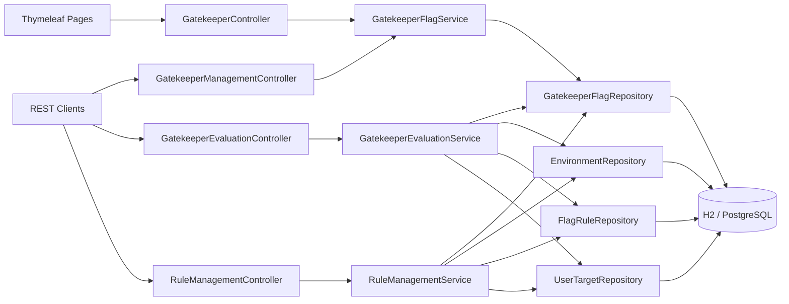

# GateKeeper

GateKeeper is a Spring Boot application for managing GateKeeper flags, environment-specific rules, user targeting, and percentage rollouts. It includes both REST APIs and simple Thymeleaf pages so you can manage rules from the browser while keeping the backend cleanly layered.

## What Is Included

- GateKeeper flag CRUD
- Environment-aware rule management
- Rule types:
  - `GLOBAL`
  - `USER_TARGET`
  - `PERCENTAGE`
- Deterministic evaluation by `flagKey + userId + environment`
- Thymeleaf pages for listing, creating, viewing, and managing GateKeeper flags
- H2 support by default
- PostgreSQL profile support
- Unit tests for GateKeeper evaluation logic

## Tech Stack

- Java 17
- Spring Boot 3
- Spring Web
- Spring Data JPA
- Thymeleaf
- Lombok
- H2
- PostgreSQL
- JUnit 5 / Mockito

## Project Structure

```text
com.gatekeeper
├── GateKeeperApplication
├── config
│   ├── DataInitializer
│   └── DataSourceConfig
├── controller
│   ├── GatekeeperController
│   ├── GatekeeperEvaluationController
│   ├── GatekeeperManagementController
│   └── RuleManagementController
├── dto
├── evaluation
│   └── FlagEvaluationEngine
├── model
│   ├── Environment
│   ├── FlagRule
│   ├── GatekeeperFlag
│   ├── RuleType
│   └── UserTarget
├── repository
│   ├── EnvironmentRepository
│   ├── FlagRuleRepository
│   ├── GatekeeperFlagRepository
│   └── UserTargetRepository
└── service
    ├── GatekeeperEvaluationService
    ├── GatekeeperFlagService
    └── RuleManagementService
```

## Domain Model

### `GatekeeperFlag`

Represents the main GateKeeper flag definition:

- `id`
- `key`
- `name`
- `description`
- `enabled`
- `createdAt`
- `updatedAt`

### `Environment`

Represents a deployment environment:

- `id`
- `name`

Seeded automatically on startup:

- `test`
- `uat`
- `prod`

### `FlagRule`

Represents a rule for a GateKeeper flag in an environment:

- `id`
- `flag`
- `environment`
- `ruleType`
- `percentage`
- `enabled`

### `UserTarget`

Represents a targeted user attached to a `USER_TARGET` rule:

- `id`
- `flagRule`
- `userId`

## Evaluation Logic

`GatekeeperEvaluationService` evaluates a GateKeeper flag using this order:

1. If the GateKeeper flag itself is disabled, return `false`
2. If an enabled `GLOBAL` rule exists for the environment, return `true`
3. If an enabled `USER_TARGET` rule contains the user, return `true`
4. If an enabled `PERCENTAGE` rule exists:
   - hash `flagKey + userId + environment`
   - convert to a bucket between `0` and `99`
   - return `true` if `bucket < percentage`
5. Otherwise return `false`

This makes rollout results deterministic for the same user, flag, and environment.

## REST API

### GateKeeper Flag Management

- `POST /api/flags`
- `GET /api/flags`
- `PUT /api/flags/{id}`
- `DELETE /api/flags/{id}`

Example create request:

```json
{
  "key": "beta-checkout",
  "name": "Beta Checkout",
  "description": "Controls access to the new checkout flow",
  "enabled": true
}
```

### GateKeeper Evaluation

- `GET /api/evaluate?flagKey=beta-checkout&userId=alice&environment=prod`

Example response:

```json
{
  "flagKey": "beta-checkout",
  "userId": "alice",
  "environment": "prod",
  "enabled": true
}
```

### Rule Management

- `POST /api/flags/{flagId}/rules`
- `POST /api/rules/{ruleId}/targets`
- `PUT /api/rules/{ruleId}/percentage`
- `PATCH /api/rules/{ruleId}/status`

Example add rule request:

```json
{
  "environment": "prod",
  "ruleType": "PERCENTAGE",
  "percentage": 30,
  "enabled": true
}
```

Example add user targets request:

```json
{
  "userIds": ["alice", "bob"]
}
```

Example update rule status request:

```json
{
  "enabled": false
}
```

## Thymeleaf Pages

The app also includes simple functional server-rendered pages:

- `/flags` - GateKeeper flag list page
- `/flags/create` - create GateKeeper flag page
- `/flags/{id}` - GateKeeper flag details page
- `/flags/{id}/rules` - rule management page

## Testing

Unit tests currently cover the GateKeeper evaluation service:

- flag disabled
- global rule enabled
- targeted user rule
- percentage rollout deterministic behavior
- same user always gets the same result

Test file:

- [GatekeeperEvaluationServiceTest.java](/Users/varun/gatekeeper/src/test/java/com/gatekeeper/service/GatekeeperEvaluationServiceTest.java)

## Configuration

### Default Profile: H2

The application uses the `h2` profile by default.

- in-memory database
- H2 console enabled at `/h2-console`

### PostgreSQL Profile

Use the `postgres` profile if you want to run against PostgreSQL.

Default values in `application-postgres.yml`:

- database: `gatekeeper`
- username: `postgres`
- password: `postgres`

Update these values before running against a real local PostgreSQL instance.

## How To Run Locally

### Prerequisites

- Java 17 installed
- Maven installed and available as `mvn`

Check them:

```bash
java -version
mvn -version
```

### Run With H2

From the project root:

```bash
cd /Users/varun/gatekeeper
./mvnw spring-boot:run
```

If `./mvnw` does not work in your machine, use:

```bash
mvn spring-boot:run
```

Then open:

- app UI: [http://localhost:8080/flags](http://localhost:8080/flags)
- evaluation endpoint example: [http://localhost:8080/api/evaluate?flagKey=beta-checkout&userId=alice&environment=prod](http://localhost:8080/api/evaluate?flagKey=beta-checkout&userId=alice&environment=prod)
- H2 console: [http://localhost:8080/h2-console](http://localhost:8080/h2-console)

Suggested H2 console values:

- JDBC URL: `jdbc:h2:mem:gatekeeperdb`
- User Name: `sa`
- Password: leave empty

### Run With PostgreSQL

Make sure PostgreSQL is running and the database exists, then run:

```bash
cd /Users/varun/gatekeeper
./mvnw spring-boot:run -Dspring-boot.run.profiles=postgres
```

Or:

```bash
mvn spring-boot:run -Dspring-boot.run.profiles=postgres
```

## How To Try The App

One simple manual flow:

1. Open [http://localhost:8080/flags](http://localhost:8080/flags)
2. Create a new GateKeeper flag
3. Open its details page
4. Open rule management
5. Add a `GLOBAL`, `USER_TARGET`, or `PERCENTAGE` rule for `test`, `uat`, or `prod`
6. Add user targets or set rollout percentage
7. Call the evaluation endpoint in the browser or with `curl`

Example:

```bash
curl "http://localhost:8080/api/evaluate?flagKey=beta-checkout&userId=alice&environment=prod"
```

## Architecture Diagram


