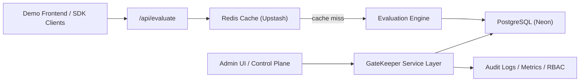

# GateKeeper

GateKeeper is a production-style feature flag platform built with Java and Spring Boot. It combines a control plane for flag management and governance with a low-latency data plane for runtime evaluation, backed by PostgreSQL, Redis, and a lightweight demo frontend.

The project is designed to showcase feature delivery architecture rather than simple CRUD: deterministic rollouts, cache-backed evaluation, auditability, RBAC, and a Java SDK simulator with local TTL caching.

## Live Demo Links

- Frontend Demo (Netlify): [gatekeeper-t5gd.netlify.app](https://gatekeeper-t5gd.netlify.app/)
- Admin UI / Control Plane (Render): [gatekeeper-t5gd.onrender.com/flags](https://gatekeeper-t5gd.onrender.com/flags)
- Evaluation API Example: [gatekeeper-t5gd.onrender.com/api/evaluate?flagKey=new-homepage&userId=alice&environment=prod](https://gatekeeper-t5gd.onrender.com/api/evaluate?flagKey=new-homepage&userId=alice&environment=prod)
- Repository: [github.com/Varun1300211/gatekeeper](https://github.com/Varun1300211/gatekeeper)

## Architecture Overview

**Control plane**

- Admin UI for flag and rule management
- Environment-specific rollout configuration
- Audit logging and soft-delete lifecycle
- RBAC with admin and viewer roles

**Data plane**

- `GET /api/evaluate` runtime evaluation endpoint
- Deterministic rollout engine for `GLOBAL`, `USER_TARGET`, and `PERCENTAGE` rules
- Redis-backed evaluation caching with cache invalidation on config changes
- Java SDK simulator with local TTL cache for client-side evaluation behaviour

## System Architecture



GateKeeper separates operational management from runtime evaluation. Admin workflows update durable configuration in PostgreSQL, while the evaluation path is optimized around Redis caching and deterministic rule resolution.

## Key Features

- Feature flag CRUD with optimistic locking
- Environment-specific rollout rules for `test`, `uat`, and `prod`
- Deterministic percentage rollouts using `flagKey + userId + environment`
- Redis-backed evaluation caching with explicit invalidation
- Bucket4j-based rate limiting on `/api/evaluate`
- Kill switch support for immediate feature shutdown
- Soft delete via archiving instead of hard delete
- Audit logging for configuration changes
- In-memory flag evaluation metrics
- RBAC with admin and viewer access
- Java SDK simulator with polling and local TTL cache
- React + Vite demo consumer app for live feature visualization

## Tech Stack

- Java 17
- Spring Boot 3.2
- Spring Web, Spring Data JPA, Spring Security, Spring Cache
- Thymeleaf
- PostgreSQL
- Redis
- React + Vite
- JUnit 5 / Mockito
- Render, Neon, Upstash, Netlify

## Evaluation Flow / Hot Path

1. A client calls `GET /api/evaluate` with `flagKey`, `userId`, and `environment`.
2. GateKeeper applies hot-path rate limiting to protect the evaluation service from abuse.
3. GateKeeper checks Redis for a cached evaluation result.
4. On a cache miss, the evaluation engine loads the flag configuration, applies rule priority (`GLOBAL` -> `USER_TARGET` -> `PERCENTAGE`), and computes the result deterministically.
5. The result is returned and cached; any flag or rule mutation evicts affected evaluation cache entries.

This design keeps the data plane fast while ensuring rollout behaviour remains stable across repeated requests.

## Running Locally

Backend:

```bash
./mvnw spring-boot:run
```

Frontend demo:

```bash
cd demo-frontend
cp .env.example .env
npm install
npm run dev
```

Local defaults:

- Backend: [http://localhost:8080/flags](http://localhost:8080/flags)
- Frontend: [http://localhost:5173](http://localhost:5173)
- Demo auth: `admin/admin123`, `viewer/viewer123`

## Future Improvements

- Multivariate and JSON-backed flag values
- Push-based SDK updates with Redis Pub/Sub or SSE
- Persistent metrics export via Micrometer / Prometheus
- Database-backed user management instead of in-memory demo auth
- Rate limiting and API keys for public evaluation traffic

## Summary

GateKeeper is a backend-heavy systems project that demonstrates production-style feature delivery architecture: control plane vs data plane separation, deterministic rollouts, cache-backed low-latency evaluation, operational safeguards, and cloud deployment. It is intentionally scoped to be easy to demo while still surfacing the design decisions that matter in real-world feature flag platforms.
