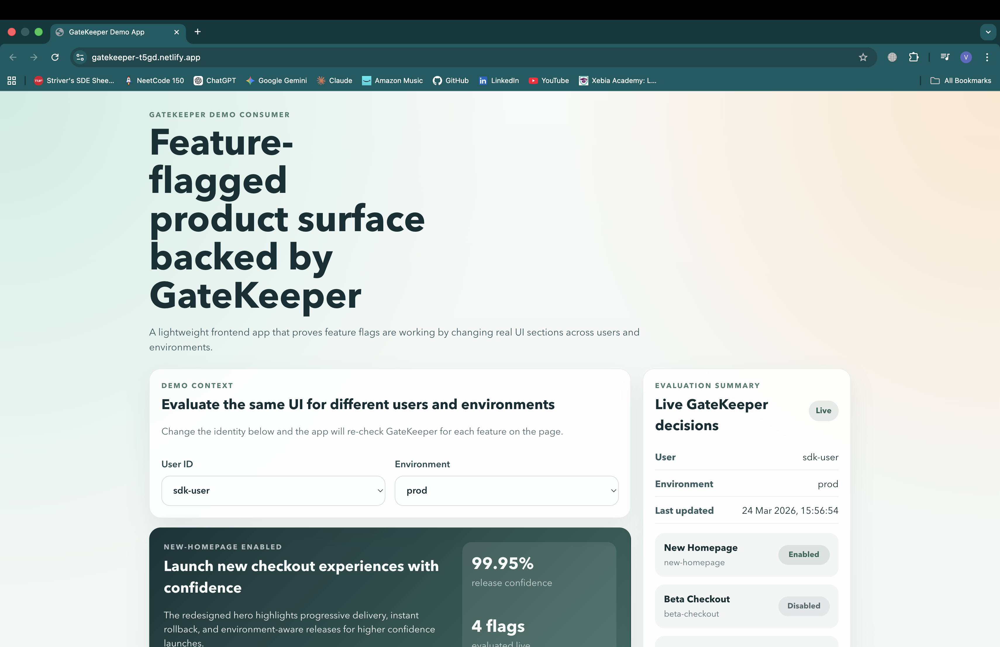
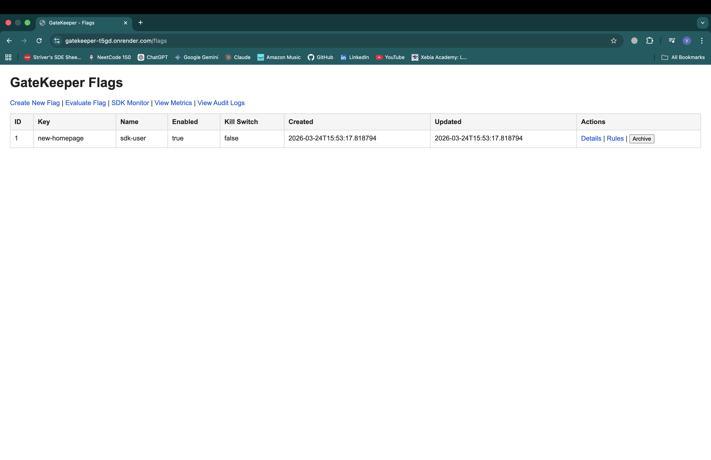
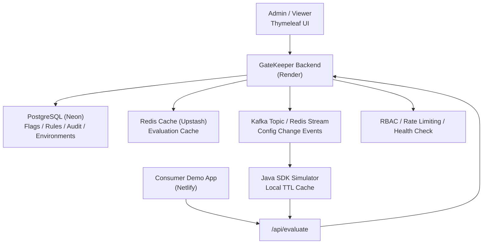
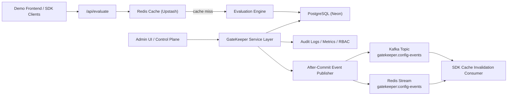

# GateKeeper

Production-style feature flag platform with control plane / data plane architecture, deterministic rollouts, Redis-backed caching, Kafka/Redis Streams-backed config-change events, RBAC, audit logging, and cloud deployment.

GateKeeper is a production-style feature flag platform built with Java and Spring Boot. It combines a control plane for flag management and governance with a low-latency data plane for runtime evaluation, backed by PostgreSQL, Redis, and a lightweight demo frontend.

The project is designed to showcase feature delivery architecture rather than simple CRUD: deterministic rollouts, cache-backed evaluation, auditability, RBAC, Kafka-backed event propagation, and a Java SDK simulator with local TTL caching plus stream-driven invalidation.

## Live Demo Links

- Frontend Demo (Netlify): [gatekeeper-t5gd.netlify.app](https://gatekeeper-t5gd.netlify.app/)
- Admin UI / Control Plane (Render): [gatekeeper-t5gd.onrender.com/flags](https://gatekeeper-t5gd.onrender.com/flags)
- Evaluation API Example: [gatekeeper-t5gd.onrender.com/api/evaluate?flagKey=new-homepage&userId=alice&environment=prod](https://gatekeeper-t5gd.onrender.com/api/evaluate?flagKey=new-homepage&userId=alice&environment=prod)

## Screenshots

**Consumer Demo App**



**Admin Control Plane**



## Architecture Overview

**Control plane**

- Admin UI for flag and rule management
- Environment-specific rollout configuration
- Audit logging and soft-delete lifecycle
- RBAC with admin and viewer roles

**Data plane**

- `GET /api/evaluate` runtime evaluation endpoint
- Deterministic rollout engine for `GLOBAL`, `USER_TARGET`, and `PERCENTAGE` rules
- Redis-backed evaluation caching with cache invalidation on config changes
- Kafka-backed config-change event pipeline for SDK cache invalidation when the `kafka` profile is active
- Redis Streams-backed config-change events as a lightweight deployment-friendly transport
- Java SDK simulator with local TTL cache for client-side evaluation behaviour

## Architecture Diagram


```mermaid
flowchart TB
    A["Admin / Viewer<br/>Thymeleaf UI"] --> B["GateKeeper Backend<br/>(Render)"]
    F["Consumer Demo App<br/>(Netlify)"] --> G["/api/evaluate"]
    H["Java SDK Simulator<br/>Local TTL Cache"] --> G
    G --> B
    B --> C["PostgreSQL (Neon)<br/>Flags / Rules / Audit / Environments"]
    B --> D["Redis Cache (Upstash)<br/>Evaluation Cache"]
    B --> I["Kafka Topic / Redis Stream<br/>Config Change Events"]
    I --> H
    B --> E["RBAC / Rate Limiting / Health Check"]
```

At a high level, GateKeeper keeps configuration and governance in the control plane while serving runtime feature decisions through a protected, cached data plane. The admin UI writes durable flag state to PostgreSQL, while demo consumers and SDK clients hit `/api/evaluate`, which is rate-limited, cache-backed with Redis, and powered by deterministic rollout logic. Flag and rule changes publish config-change events to Kafka or Redis Streams so SDK clients can invalidate local cache without waiting for TTL expiry.

## System Architecture


```mermaid
flowchart LR
    A["Admin UI / Control Plane"] --> B["GateKeeper Service Layer"]
    F["Demo Frontend / SDK Clients"] --> C["/api/evaluate"]
    C --> D["Redis Cache (Upstash)"]
    D -->|cache miss| E["Evaluation Engine"]
    E --> G["PostgreSQL (Neon)"]
    B --> G
    B --> H["Audit Logs / Metrics / RBAC"]
    B --> I["After-Commit Event Publisher"]
    I --> J["Kafka Topic<br/>gatekeeper.config-events"]
    I --> L["Redis Stream<br/>gatekeeper:config-events"]
    J --> K["SDK Cache Invalidation Consumer"]
    L --> K
```

GateKeeper separates operational management from runtime evaluation. Admin workflows update durable configuration in PostgreSQL, while the evaluation path is optimized around Redis caching and deterministic rule resolution.

## Key Features

- Feature flag CRUD with optimistic locking
- Environment-specific rollout rules for `test`, `uat`, and `prod`
- Deterministic percentage rollouts using `flagKey + userId + environment`
- Redis-backed evaluation caching with explicit invalidation
- Kafka-backed async config-change events after successful DB commits
- Redis Streams fallback for lightweight deployment environments
- Bucket4j-based rate limiting on `/api/evaluate`
- Kill switch support for immediate feature shutdown
- Soft delete via archiving instead of hard delete
- Audit logging for configuration changes
- In-memory flag evaluation metrics
- RBAC with admin and viewer access
- Java SDK simulator with polling, local TTL cache, and event-driven invalidation
- React + Vite demo consumer app for live feature visualization

## Tech Stack

- Java 17
- Spring Boot 3.2
- Spring Web, Spring Data JPA, Spring Security, Spring Cache
- Thymeleaf
- PostgreSQL
- Redis / Redis Streams
- Kafka
- React + Vite
- JUnit 5 / Mockito
- Render, Neon, Upstash, Netlify

## Evaluation Flow / Hot Path

1. A client calls `GET /api/evaluate` with `flagKey`, `userId`, and `environment`.
2. GateKeeper applies hot-path rate limiting to protect the evaluation service from abuse.
3. GateKeeper checks Redis for a cached evaluation result.
4. On a cache miss, the evaluation engine loads the flag configuration, applies rule priority (`GLOBAL` -> `USER_TARGET` -> `PERCENTAGE`), and computes the result deterministically.
5. The result is returned and cached; any flag or rule mutation evicts affected evaluation cache entries.

This design keeps the data plane fast while ensuring rollout behaviour remains stable across repeated requests.

## Config Change Event Flow

1. An admin creates, updates, archives, or changes rules for a flag.
2. The database transaction commits successfully.
3. An after-commit listener publishes a config-change message to Kafka topic `gatekeeper.config-events` when the `kafka` profile is active.
4. Without the `kafka` profile, the same event is appended to Redis Stream `gatekeeper:config-events`.
5. SDK consumers read the event stream and evict matching local cache entries.
6. The next SDK evaluation fetches fresh flag state immediately instead of waiting for TTL expiry.

## Running Locally

Backend:

```bash
./mvnw spring-boot:run
```

Frontend demo:

```bash
cd demo-frontend
cp .env.example .env
npm install
npm run dev
```

Local defaults:

- Backend: [http://localhost:8080/flags](http://localhost:8080/flags)
- Frontend: [http://localhost:5173](http://localhost:5173)
- Demo auth: `admin/admin123`, `viewer/viewer123`

Redis-backed caching and config-change events run when the `redis` profile is active, using `REDIS_URL`.

Kafka event transport:

```bash
docker compose -f docker-compose.kafka.yml up -d
SPRING_PROFILES_ACTIVE=h2,kafka KAFKA_BOOTSTRAP_SERVERS=localhost:9092 ./mvnw spring-boot:run
```

Use `SPRING_PROFILES_ACTIVE=h2,redis,kafka` when you want Redis evaluation caching and Kafka config-change events together.

For multiple SDK/client applications, use an app-specific `KAFKA_CONSUMER_GROUP_ID` so each application receives every config-change event.

The SDK monitor starts with no configured targets by default. Add targets from `/sdk`, or pass `--gatekeeper.sdk.targets[0].flag-key=...`, `--gatekeeper.sdk.targets[0].user-id=...`, and `--gatekeeper.sdk.targets[0].environment=...` at startup.

## Deployment Architecture

GateKeeper is deployed using managed cloud services:

- Backend API hosted on Render
- PostgreSQL hosted on Neon
- Redis hosted on Upstash for evaluation caching and lightweight config-change events
- Demo frontend hosted on Netlify

This setup mirrors a typical cloud-native architecture where the application server, cache, and database are independently managed services. Kafka is implemented as an optional profile for local/system-design demos and can be enabled with a managed Kafka broker.

## Deployment Note

The hosted demo is intentionally kept lightweight to avoid maintaining always-on managed Redis/Kafka infrastructure for a portfolio project. Kafka-backed config-change propagation and SDK cache invalidation are fully implemented behind the `kafka` profile and can be demonstrated locally with Docker, while the deployed app can run on the simpler Render/Neon/Netlify path.

## Redis Warmup

A scheduled GitHub Actions workflow calls `/healthz` and `/api/evaluate` once per day to keep the deployed backend and Redis-backed evaluation path active. Configure these repository secrets before enabling it:

- `GATEKEEPER_BACKEND_URL`: deployed backend URL, for example `https://gatekeeper-t5gd.onrender.com`
- `GATEKEEPER_VIEWER_USERNAME`: viewer username
- `GATEKEEPER_VIEWER_PASSWORD`: viewer password

The workflow can also be run manually from GitHub Actions using `Redis Warmup` -> `Run workflow`.

## Future Improvements

- Multivariate and JSON-backed flag values
- Schema Registry and versioned config-change event contracts
- Dead-letter topic and retry strategy for failed config-change consumers
- SSE or gRPC streaming SDK updates for lower-latency client propagation
- Persistent metrics export via Micrometer / Prometheus
- Database-backed user management instead of in-memory demo auth
- API key lifecycle management for public evaluation traffic

## Summary

GateKeeper is a backend-heavy systems project that demonstrates production-style feature delivery architecture: control plane vs data plane separation, deterministic rollouts, cache-backed low-latency evaluation, Kafka/Redis Streams-backed config-change propagation, operational safeguards, and cloud deployment. It is intentionally scoped to be easy to demo while still surfacing the design decisions that matter in real-world feature flag platforms.
